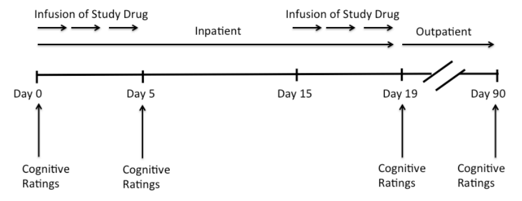

```{r load-analysis, include = F}
source(knitr::purl("./EDA.Rmd", quiet=TRUE))
source(knitr::purl("./stat_analysis.Rmd", quiet=TRUE))
knitr::opts_chunk$set(echo = FALSE, message = F, warning = F)
library(visdat)
library(mice)
library(VIM)
library(lattice)
library(ggplot2)
library(miceadds)
library(formattable)
library(graphics)
```

# Introduction

Cognitive deficits (e.g. poor memory, poor attention) are common problems among 
individuals with schizophrenia (SCZ). A randomized trial was conducted to test whether stimulation of dopamine-1 receptors in the brain via a full, selective agonist (DAR-0100A) would improve cognitive deficits in schizophrenia.

# Method

## Study Design

A total of 47 clinically stable individuals with SCZ were randomized to treatment with either 1) high dose (15mg) DAR-0100A, 2) low dose (0.5mg) DAR-0100A, or 3) placebo (normal saline).

Figure \@ref(fig:design-str) shows the study design including when the drug was administered and 
assessments of cognitive ratings taken. The study drug (DAR-0100A) must be administered via intravenous infusion and done within an inpatient setting due to the possibility of adverse outcomes including fainting. Individuals were admitted to an inpatient clinic for a total of 19 days. On day 0 (prior to beginning the infusion of the study drug) subjects completed a battery of cognitive ratings. Then for 5 days they received the study drug and at the end of day 5 they completed the same battery of cognitive ratings. After 10 days without the drug, they were again given the drug from Day 15 to Day 19. At the end of Day 19 subjects again completed the same battery of cognitive ratings. The individuals were then released from the inpatient setting and on Day 90 returned to the study site to complete a final battery of the same cognitive ratings. The cognitive ratings were combined into a composite memory score called `mem_comp` at each assessment time and this is its name in the dataset.

```{r design-str, out.width="80%", fig.cap = "Study Design."}

```

The dataset also included variables of treatment group, day, age (years) and gender (`M` for male, `F` for female). The primary objective of the study was to assess whether DAR-0100A treatment at low (`treatment_group = B` in associated data) or high dose (`treatment_group = C` in associated data) compared to placebo (`treatment_group = A` in associated data) is able to improve memory as measured by the `mem_comp` rating. The `mem_comp` is a computerized test that subjects take and higher values indicate better memory while lower values indicate poorer memory. 

## Research Interests

Researchers were specifically interested in the treatment effects at day 5, 19, and 90 and also in whether the treatment effects differed over time. Missing data were a concern. Researchers were also interested in sensitivity analyses that can be used to assess the robustness of the missing data assumption.

## Statistical Analysis

### Analyses on Treatment Effects

To investigate the treatment effects of the target drug, we built a marginal model with identical link to analysis the treatment effects. The equation \@ref(eq:model-1) shows the model for analysing treatment effects. Here, $Y_{ki}$ denotes the $i$-th difference of composite memory score between baseline and $i$-th measurement for the $k$-th subject, $i = 1,2,3$, represent the difference at day 5, day 19 and day 90, respectively. Let $\boldsymbol{Y}_{k}=\left(Y_{k 1}, Y_{k 2},Y_{k 3}\right)^{T}$ denotes the complete observation of the $k$-th subject. $\mu_{ki} =  \mathrm{E}[Y_{ki}\mid \mathbf{X}_{ki}]$ and $\boldsymbol{\mu}_k = (\mu_{k1}, \mu_{k2}, \mu_{k3})^T$. $\boldsymbol{X}_{ki}$ denotes the vector containing baseline covariates (age and gender), treatment indicators, time variable and the interaction between time and treatments. Here we treated the time variable as a categorical variable and we centered age at the mean age for better interpretations.

\begin{equation}
\begin{split}
    \mathrm{E}[Y_{ki}\mid \mathbf{X}_{ki}] & = \mu_{ki} = 
    \beta_0 + \beta_1 \cdot \mathbf{I}(t_{ki} = 19)+ \beta_2 \cdot \mathbf{I}(t_{ki} = 90) \\
    &+ \beta_3 \cdot \mathbf{I}(\text{treatment}_{k} = B)\\
    &+ \beta_4 \cdot \mathbf{I}(\text{treatment}_{k} = C) + \beta_5\cdot \text{age}_{k} \\
    &+ \beta_6\cdot\mathbf{I}(\text{gender}_{k} = \text{female})\\
\end{split}
(\#eq:model-1)
\end{equation}

To test whether this is any treatment effects, we first conducted a test testing against the following null hypothesis $H_0: \beta_3 = \beta_4 = 0$ versus $H_1: \text{At least one of }\beta_3,\beta_4 \text{ is not zero}$. Once we rejected the above null hypothesis, we conclude that the treatment effect exists, then conduct the following analysis on the effects of the interaction between treatments and time by using the following model shown in equation \@ref(eq:model-2).

\begin{equation}
\begin{split}
    \mathrm{E}[Y_{ki}\mid \mathbf{X}_{ki}] & = \mu_{ki} =
    \beta_0 + \beta_1 \cdot \mathbf{I}(t_{ki} = 19)+ \beta_2 \cdot \mathbf{I}(t_{ki} = 90) \\
    &+ \beta_3 \cdot \mathbf{I}(\text{treatment}_{k} = B)\\
    &+ \beta_4 \cdot \mathbf{I}(\text{treatment}_{k} = C) + \beta_5\cdot \text{age}_{k} \\
    &+ \beta_6\cdot\mathbf{I}(\text{gender}_{k} = \text{female})\\
    & + \beta_{7} \cdot\mathbf{I}(t_{ki} = 19)\cdot\mathbf{I}(\text{treatment}_{k} = B)\\
    & + \beta_{8} \cdot\mathbf{I}(t_{ki} = 90)\cdot\mathbf{I}(\text{treatment}_{k} = B)\\
    & + \beta_{9} \cdot\mathbf{I}(t_{ki} = 19)\cdot\mathbf{I}(\text{treatment}_{k} = C)\\
    & + \beta_{10} \cdot\mathbf{I}(t_{ki} = 90)\cdot\mathbf{I}(\text{treatment}_{k} = C)\\
\end{split}
(\#eq:model-2)
\end{equation}

We also did a test against the null $H_0: \beta_7 = \beta_8 = \beta_9 = \beta_{10 }= 0$ versus $H_1: \text{At least one of }\beta_7, \beta_8, \beta_9 ,\beta_{10 } \text{ is not zero}$ for testing whether or not the treatment effects differ from time. We conclude that there exist interactions between time and treatment after we reject the null and exclude the interaction terms from the model.

## Handling Missing Data

As discussed above, there is missingness in the composite memory score measurements, and some subjects had intermittent missingness, meaning that they may not have the observations on day 5 or day 19 but have an observation at day 90 after the outpatient period. In order to handle this issue, we considered the following missing mechanism and implemented different analyses methods for each case.

To identify which specific elements of $\boldsymbol{Y}_k$ are observed, define
$$
R_{k i}= \begin{cases}1 & \text { if } Y_{k i} \text { is observed } \\ 0 & \text { otherwise }\end{cases}
$$
and let $\boldsymbol{R}_{k}=\left(R_{k 1},  R_{k 2},  R_{k 3}\right)$. We considered the following missing mechanisms: 1) Missing completely at random (MCAR): Missingness does not depend on either the outcome or on covariates that are of substantive interest, mathematically, this means $\Pr(\boldsymbol{R}_k = 1| \boldsymbol{Y}_k, \boldsymbol{X}_k) = \Pr(\boldsymbol{R}_k = 1)$. 2) Missing at random (MAR): Missingness depends on the outcome and/or covariates that are of substantive interest solely through what is actually observed. 3) Missing not at random (MNAR): Missingness depends, in part at least, on unobserved outcomes and/or covariates that are of substantive interest.

Under MCAR assumption, we built the models mentioned above with and did a complete-case analysis with generalized estimation equations (GEE). More specifically, we considered the following estimating equation 
$$
\sum_{k=1}^{K} I\left(\boldsymbol{R}_{k}=\mathbf{1}\right) \boldsymbol{D}_{k}^{T} \boldsymbol{V}_{k}^{-1}\left(\boldsymbol{Y}_{k}-\boldsymbol{\mu}_{k}\right)=\mathbf{0},
$$
where where $K = 47$.  $\boldsymbol{D}_{k} = \frac{\partial}{\partial\boldsymbol{\beta}}\boldsymbol{\mu}_k$. $\boldsymbol{V}_k$ is the working covariance matrix, here we considered independent covariance structure, auto regressive structure (AR-1) and exchangeable structure. Under MCAR assumption, this complete-case GEE will give us a consistent estimator and a valid variance estimator.

Under MAR assumption, we considered using inverse probability weighting (IPW) to account for the missingness. We considered the weight $w_{ki} = \pi_{ki}^{-1}$ where $\pi_{ki}$ is the conditional probability of observing subject $k$ at the $i$ th time point, given their observed history up to that time. We estimate this probability by estimating the following risk  $\lambda_{ki} = \Pr(R_{ki} = 0 \mid R_{k(i-1)} = 1, \mathbf{X}_{ki})$, here $i =1,2,3$. We defined $R_{k0} = 1$ for all $k$ since all subjects are observed at day 0. We used the following proportional risk model to estimate the $\lambda_{ki}$
$$
\lambda_{ki} = \lambda_0(t_{ki})\exp\{\gamma_1\cdot\mathbf{I}(\text{treatment}_{k} = B) + \gamma_2\cdot\mathbf{I}(\text{treatment}_{k} = C) + \gamma_3\cdot\mathbf{I}(\text{gender}_{k} = \text{female}) + \gamma_4\cdot \text{age}_{k}\},
$$
where $\lambda_0(t_{ki})$ is the unspecified baseline risk at time $t_{ki}$, the discrete time variable. After fitting the model, we can get the estimated risk $\widehat{\lambda}_{ki}$ and we calculate $\widehat{\pi}_{ki}$ as $\widehat{\pi}_{kj} = \prod_{i = 1}^{j}\widehat{\lambda}_{ki}$. Then we considered the following IPW avaliable-data GEE
$$
\sum_{k=1}^{K} \boldsymbol{D}_{k}^{T} \boldsymbol{V}_{k}^{-1} \boldsymbol{\Delta}_{k}\left(\boldsymbol{Y}_{k}-\boldsymbol{\mu}_{k}\right)=\mathbf{0},
$$
where $K = 47$. $\mathcal{R}_{k}$ is an $n \times n$ diagonal matrix with elements $\mathbf{I}\left(R_{k i}=1\right)$ on the diagonal indicating whether or not the $i$-th measurement is observed. $\mathcal{W}_{k}$ is an $n \times n$ diagonal matrix with elements $\pi_{k i}^{-1}$ on the diagonal. We replace $\pi_{k i}$ with $\widehat{\pi}_{k i}$. Under some additional assumptions provided in @Robins1995, this IPW available-data GEE will give us consistent and valid estimates.

Under MNAR, in order to assess the robustness of our findings, we implemented sensitivity analyses. Our approach based on pattern-mixture model, focusing on the examination of treatment effects under various assumptions about participants who discontinue the study. Specifically, we employed a pattern-mixture model that add an outcome mean deviation for participants who drop out of the study, defined by an offset, a wide range of $\delta$, ranging from -0.1 to 5. This model allowed us to explore the impact of different offset values on the treatments comparison within the study groups (@Little2012). Our criterion for robustness was the maintenance of the treatment effect across a range of clinically plausible offsets. Missing values were imputed by predictive mean matching method implemented in `mice` package in `R` (@Buuren2011), number of multiple imputations were 5. We analyzed each pooled imputed dataset by using GEE with independence covariance structure. Variance of the estimates were calculated according to the Rubin's Formula(@rubin2018multiple).

# Result

## Baseline Characteristics of the Study Population

Table \@ref(tab:report-tbl1) shows the distributions of the baseline covariates, including demographic variables and baseline composite memory score. It is difficult to determine if there is an imbalance in the distributions of the baseline covariates due to the small sample size. However, we observed some potential imbalances. The low-dose treatment group (treatment group B) appears to have a younger average age, while the high-dose treatment group (treatment group C) seems to have a lower baseline memory score.
```{r report-tbl1}
table1( ~ gender + age + mem_comp | treatment_group, data=data.baseline, render.continuous=my.render.cont, caption="Descriptive statistics of baseline characteristics of the 47 subjects by treatment groups.") %>% t1kable(booktabs = TRUE) %>%  kable_styling(latex_options = c("hold_position", "scale_down"))
```

## Longitudinal Outcomes of the Patients

Figure \@ref(fig:long-plot) shows the change of primary outcomes in two different measures across time. From the left panel we can see that there is a decreasing trend of memory score in placebo group while there are not clearly trend in treatment group B and C. From the right panel, we see decreasing trends in placebo group and treatment group C, while there is a increasing trend in treatment group B.

```{r long-plot, fig.height = 3, fig.width=9, fig.cap = "Change of composite memory score across time. Left panel: Change of raw memory score, stratified by treatments. Right panel: Change of difference between current memory score and baseline memory score. The blue line is the population trend fitted by linear model."}
traj.plot + traj.change.plot
```


To investigate the missing data pattern, we categorized the subjects in to two groups, one group is the completer, who had all 4 observations. The other group is the drop-out group, who had less than 4 observations. We summarized the mean change of composite memory as well as the change of mean difference between current memory score and baseline memory score in figure \@ref(fig:mean-traj-plot). From the left panel, we can see that drop-outs seem to have a higher mean composite memory score at all time points in all treatment groups, while from the right panel, we only see that a higher change of memory score in treatment group C. From these two plots, we can see that the missingness might not be completely at random.

```{r mean-traj-plot, fig.width=8, fig.height=4, fig.cap = "Change of mean composite memory score across time in completers and drop-outs. Left panel: Change of raw memory score, stratified by treatments. Right panel: Change of difference between current memory score and baseline memory score."}
mean.score.plot <- 
  data.comp %>% 
  group_by(subject_id) %>% 
  mutate(total_obs = sum(as.numeric(observed))) %>% 
  ungroup() %>% 
  mutate(type = as.factor(ifelse(total_obs == 4, "Completer", "Drop-out"))) %>% 
  group_by(type, day_fct, treatment_group) %>% 
  mutate(mean_mem_comp = mean(mem_comp,na.rm = T)) %>% 
  dplyr::select(day_fct, treatment_group, type, mean_mem_comp) %>% 
  distinct() %>% 
  ungroup() %>% 
  ggplot(aes(x = day_fct, y = mean_mem_comp, group = interaction(treatment_group, type), color = treatment_group, linetype = type)) +
  geom_line(alpha = 0.8, size = 0.5) +
  scale_linetype_manual(values = c("Completer" = "solid", "Drop-out" = "dashed")) +
  labs(color = "Treatment Group", linetype = "Type") +
  ylab("Composite memory score")+
  xlab("Days of observation")+
  theme_bw()+
  theme(legend.position = "none")

mean.score.change.plot <-
  data.comp %>% 
  filter(day > 0) %>% 
  mutate(day_fct = factor(day_fct, levels = c(5,19,90))) %>% 
  group_by(subject_id) %>% 
  mutate(total_obs = sum(as.numeric(observed))) %>% 
  ungroup() %>% 
  mutate(type = as.factor(ifelse(total_obs == 3, "Completer", "Drop-out"))) %>% 
  group_by(type, day_fct, treatment_group) %>% 
  mutate(mean_mem_comp = mean(mem_comp_delta,na.rm = T)) %>% 
  dplyr::select(day_fct, treatment_group, type, mean_mem_comp) %>% 
  distinct() %>% 
  ungroup() %>% 
  ggplot(aes(x = day_fct, y = mean_mem_comp, group = interaction(treatment_group, type), color = treatment_group, linetype = type)) +
  geom_line(alpha = 0.8, size = 0.5) +
  scale_linetype_manual(values = c("Completer" = "solid", "Drop-out" = "dashed")) +
  labs(color = "Treatment Group", linetype = "Type") +
  ylab("Change of composite memory score")+
  xlab("Days of observation")+
  theme_bw()

mean.score.plot + mean.score.change.plot
```
Figure \@ref(fig:surv-plot) shows the change of proportion of subjects stayed in the study and the exact number of subjects stayed in the study across time. From the plot we can see that except for treatment group B, the placebo group and treatment group C has monotonic missing. Treatment group B has intermittent missing and thus we considered using proportional risk model to model the drop-out risk.

```{r surv-plot, fig.cap = "Proportion of subjects stayed in the study and the number of subjects stayed in the study."}
surv.curv <- stay.plot$plot + ylab("Proportion of stay in the study")
surv.bar <- stay.plot$ncensor.plot + ylab("Number of subjects") + theme(legend.position = "none")
surv.curv / surv.bar
```

## Complete Case Analysis

Table \@ref(tab:comp-tbl) shows the coefficient estimates from the complete-case analysis using the model shown in equation \@ref(eq:model-1). From the table we can see that treatment C has a positive treatment effect and it is significant. However, the test jointly testing the treatment effects are not all zero resulted in a test statistic 4.71 with 2 degree of freedoms, the p-value of this test is 0.10, which means we cannot reject the null at 0.05 significance level and conclude that there is no treatment effect. We did not use the model shown in equation \@ref(eq:model-2) since the test of time-treatment interactions did not reject the null.

```{r comp-tbl}
tbl_merge(list(model.complete.delta.1.tbl, model.complete.delta.2.tbl, model.complete.delta.3.tbl), tab_spanner = c("Independent","AR-1","Exchangable")) %>% as_kable(booktabs = T,escape = FALSE , caption = "Coefficent estimates of the treatment effects from complete-case analysis, with different working covariance structures.") %>%  kable_styling(latex_options = c("hold_position", "scale_down")) %>% add_header_above(c(" ", "Independent" = 3, "AR-1" = 3, "Exchangable" = 3))
```

## Inverse Probability Weighting Avaliable Data Analysis

Table \@ref(dropout-risk-tbl) shows the coefficients estimates from the proportional risk model modeling the dropout risk. From the results we did notn find any significant association between baseline covariates and the dropout risk.

```{r dropout-risk-tbl}
tbl_regression(model.prob.drop.coxph, exponentiate = T,label = list(
      #day_fct ~ "Days",
      treatment_group ~ "Treatment",
      age ~ "Age",
      gender ~ "Gender"
    )) %>% 
  modify_header(
  update = list(p.value = "p-value", ci = "$95\\%$ CI", label = "Characteristics", estimate = "HR")
  )  %>% as_kable(booktabs = T,escape = FALSE, caption = "Coefficent estimates of the dropout risk model.") %>%  kable_styling(latex_options = c("hold_position"))
```

Table \@ref(tab:ipw-avaliable-tbl) shows the coefficient estimates from the avaliable data analysis using the model shown in equation \@ref(eq:model-1) with IPW GEE. From the table we can see that treatment C has a positive treatment effect equals $0.40$, meaning that on average, subjects who received treatment C has $0.40$ more increase in memory score, holding everything else the same. This effect is sigificant. The test jointly testing the treatment effects are not all zero resulted in a test statistic 6.7279 with 2 degrees of freedom, the p-value of this test is 0.03, which means we reject the null at 0.05 significance level and conclude that there is at least one treatment has treatment effect. The test on time-treatment interactions resulted in a test statistic 5.72 with 4 degrees of freedom, the p-value of this test is 0.22, which means we cannot reject the null at 0.05 significance level and conclude that there is no time-treatment interaction.

```{r ipw-avaliable-tbl}
tbl_merge(list(model.ipw.coxph.1.tbl, model.ipw.coxph.2.tbl, model.ipw.coxph.3.tbl), tab_spanner = c("Independent","AR-1","Exchangable")) %>% as_kable(booktabs = T, escape = FALSE) %>%  kable_styling(latex_options = c("hold_position", "scale_down")) %>% add_header_above(c(" ", "Independent" = 3, "AR-1" = 3, "Exchangable" = 3))
```

## Sensitivity Analysis

Table \@ref(tab:sen-tbl) shows the sensitivity analysis result under model shown in equation \@ref(eq:model-1). We can see that after imputing the missing data, the treatment effect of treatment C is still significant at $\delta = 0$. Increasing or decreasing the offset value, $\delta$, all show significant results until $\delta>1.6$ or $\delta<-1.7$, which might be clinically unreasonable. These analyses shows that our result is stable under misspecification of the missing data mechanism and models.

```{r sen-tbl}
delta_MNAR_f = function(delta){
  
  MAR_step = mice(data.comp, m=5, method = "pmm", quickpred(data.comp, exc = "observed"), seed = 20, print=FALSE)
  
  MNAR_conversion_delta = 
    complete(MAR_step, action='long', include=TRUE) %>%
    mutate(mem_comp = ifelse(observed == 0, mem_comp + delta, mem_comp))
  
  MNAR_conversion_delta <- MNAR_conversion_delta %>% 
    arrange(.imp, subject_id, day) %>% 
    group_by(.imp, subject_id) %>% 
    mutate(baseline_mem_comp = first(mem_comp)) %>% 
    mutate(mem_comp_delta = mem_comp - baseline_mem_comp, na.rm = T)
  
  MNAR_conversion_delta <- MNAR_conversion_delta %>% filter(day > 0)%>% mutate(day_fct = factor(day_fct, levels = c(5,19,90)))
  
  MNAR_data_delta = as.mids(MNAR_conversion_delta)
  
  # output_delta =
  #   with(MNAR_data_delta, geeglm(mem_comp ~ day_fct + treatment_group + age + gender + treatment_group * day_fct, family = gaussian, id = subject_id, corstr = "independence"))
  output_delta =
    with(MNAR_data_delta, geeglm(mem_comp_delta ~ day_fct + treatment_group + age + gender , family = gaussian, id = subject_id, corstr = "independence"))
  
  params_delta = 
    summary(pool(output_delta)) %>%
    filter(term == "treatment_groupC") 
  
  desc_delta = with(MNAR_data_delta, expr=c("Y_mean"=mean(mem_comp), "Y_sd"=stats::sd(mem_comp)))
  desc_delta = withPool_MI(desc_delta) %>% as.data.frame() %>% t()
  
  cbind(params_delta, desc_delta)
  
}

# Set range of plausible delta values
delta_inputs = seq(-2,2,by = 0.3)

# Map output
output_delta = 
  map_df(delta_inputs, delta_MNAR_f)

rownames(output_delta) <- c()

#Output
output_formatted_delta = 
  cbind(delta_inputs, output_delta) %>%
  select(-term) %>%
  mutate(across(c("estimate":"std.error"), round, 3),
         #across(c("statistic":"df", "Y_mean":"Y_sd"), round, 2),
         p.value = round(p.value, digits = 2))

output_formatted_delta %>%
  dplyr::select(delta_inputs, estimate, std.error, p.value, Y_mean, Y_sd) %>% 
  knitr::kable(booktabs = T, escape = F, digits = 2, col.names = c("$\\delta$", "${\\widehat{\\beta}}_4$", "SD", "p-value", "Mean of outcome (after imputation)", "SD of outcome (after imputation)"), caption = "Estimated treatment effect of treatment C using imputed data with different $\\delta$ value.") %>%  kable_styling(latex_options = c("HOLD_POSITION", "scale_down"))
  
```

# Discussion

In our exploration of DAR-0100A's effects on schizophrenia-related cognitive deficits, we took rigorous steps to ensure our findings were dependable, especially by addressing missing data comprehensively. Our investigation revealed a noteworthy improvement in memory performance with a high dose of DAR-0100A, marking a promising direction for treatment strategies.

Our initial approach was based on the assumption that our missing data occurred completely at random (MCAR), employing a complete-case analysis. Despite observing significant benefits from the high dose treatment, the inability to dismiss the null hypothesis for both treatment groups suggested that MCAR might not accurately represent our data's missingness mechanism. This hypothesis was further supported by a regression analysis indicating a significant link between dropout risk and time (see Appendix A.1), suggesting that our main conclusions should lean towards analyses assuming Missing At Random (MAR). This pivot is justified by sensitivity analyses demonstrating the robustness of our results, even under various assumptions about the missing data pattern.

Yet, the study is not without its limitations. The significant relationship between dropout risk and time adds a layer of complexity to interpreting our data's missingness, potentially biasing our estimates. Our reliance on simplified sensitivity analyses, though practical, points to a need for incorporating more sophisticated models in future studies to better represent potential missing data patterns.

This research underscores the intricate challenges of clinical trials in schizophrenia, particularly in handling missing data effectively. By acknowledging these challenges and setting a foundation for methodological improvements, we pave the way for future research. Future studies are anticipated to delve deeper into finding efficacious interventions for cognitive deficits in schizophrenia, equipped with more refined methodologies and an enriched understanding of the nuances in data handling.

# Appendix {-}

## A.1 Logistic Regression Regress the Dropout Risk on Baseline Covariates {-}


```{r appendix-tbl}
tbl_regression(model.drop, exponentiate = T,label = list(
      day_fct ~ "Days",
      treatment_group ~ "Treatment",
      age ~ "Age",
      gender ~ "Gender"
    )) %>% 
  modify_header(
  update = list(p.value = "p-value", ci = "$95\\%$ CI", label = "Characteristics", estimate = "OR", caption = "Coefficient estimates of the logistic regression of dropout risk on baseline covariates.")
  )  %>% as_kable(booktabs = T, escape = FALSE, digits = 2) %>%  kable_styling(latex_options = c("hold_position", "scale_down"))
```


\fontsize{10pt}{12pt}\selectfont
```{r ref.label=knitr::all_labels(), echo=FALSE, eval=FALSE}
## A.2 Code for This Report {-}
```

